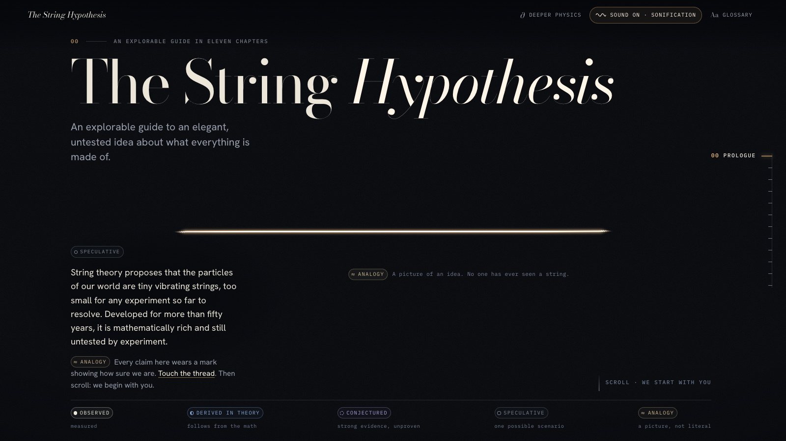

# The String Hypothesis

An explorable journey into string theory: what it proposes, why physicists take it seriously, and what remains unknown.

**▶ Visit the site: [string-hypothesis.pages.dev](https://string-hypothesis.pages.dev)**

[](https://string-hypothesis.pages.dev)

## What it is

A single scrolling experience in eleven chapters plus a prologue. One glowing thread follows you from the scale of a person down to the smallest lengths physics can describe, and from there through vibrations, extra dimensions, branes and dualities. Each chapter asks one question and has a hands-on lab where you can pluck, drag, slice and zoom the ideas yourself.

The site tries hard not to oversell. Every claim carries a mark showing how sure we are:

| Mark | Meaning |
|---|---|
| **Observed** | measured |
| **Derived in theory** | follows from the math |
| **Conjectured** | strong evidence, unproven |
| **Speculative** | one possible scenario |
| **Analogy** | a picture, not literal |

Also included:

- **Deeper physics** mode, which adds equations and technical asides.
- A glossary of about 100 terms.
- Optional sound: sonifications of the vibrations, not real string sounds.
- A no-WebGL fallback, with illustrated versions of every scene.

## Chapters

| # | Chapter | Question |
|---|---|---|
| 00 | Prologue | What is the string hypothesis? |
| 01 | Smaller | What is everything made of? |
| 02 | Vibration | How can one kind of thing look like many particles? |
| 03 | Worldsheets | What does a string do as it moves through time? |
| 04 | Gravity | Why did physicists take strings seriously? |
| 05 | Dimensions | Where would extra dimensions hide? |
| 06 | Hidden shapes | What shape could the hidden dimensions have? |
| 07 | Branes | Where do open strings end? |
| 08 | Duality | Can two different worlds be the same? |
| 09 | M-theory | Five theories, or one? |
| 10 | The scale problem | Why haven't we seen a string? |
| 11 | What we know | What do we actually know? |

## Built with

- [Vite](https://vite.dev), [React 19](https://react.dev) and TypeScript
- [three.js](https://threejs.org) through [React Three Fiber](https://r3f.docs.pmnd.rs) and drei
- [KaTeX](https://katex.org) for equations, [Lenis](https://lenis.darkroom.engineering) for scrolling, [zustand](https://zustand.docs.pmnd.rs) for state

## Running locally

You need Node.js 20.19+ or 22.12+.

```bash
npm install
npm run dev        # http://127.0.0.1:5173
npm run build      # production build into dist/
npm run preview    # serve the production build
npm run typecheck
```

These URL parameters are useful during development:

| Parameter | Effect |
|---|---|
| `?solo=<chapter-id>` | render only one chapter, e.g. `?solo=vibration` |
| `&p=0.5` | jump to a point in that chapter (0 to 1) |
| `?quality=low\|medium\|high` | force a rendering quality tier |
| `?deeper=1` | start with deeper physics mode on |
| `?nowebgl=1` | force the no-WebGL fallback |

`npm run shot` takes screenshots with Playwright. It needs Chrome installed. The options are listed at the top of `scripts/shot.mjs`.

## Project layout

```
src/
  core/        scroll engine, WebGL stage and compositor, settings, audio
  chapters/    one folder per chapter: Overlay (text and UI), Scene (3D), Fallback, glossary
  gl/          shared WebGL pieces (the thread, glow points, grids, labels)
  ui/          shared interface: chapter layout, status marks, lab controls, top bar, glossary
content/       the refereed research pack behind each chapter, and the glossary
docs/          VISION.md (creative brief) and ARCHITECTURE.md (how chapters plug in)
```

## Deployment

The site is fully static: `npm run build` produces `dist/`, which is hosted on Cloudflare Pages (project `string-hypothesis`). To deploy with Wrangler:

```bash
npx wrangler pages deploy dist --project-name string-hypothesis
```
